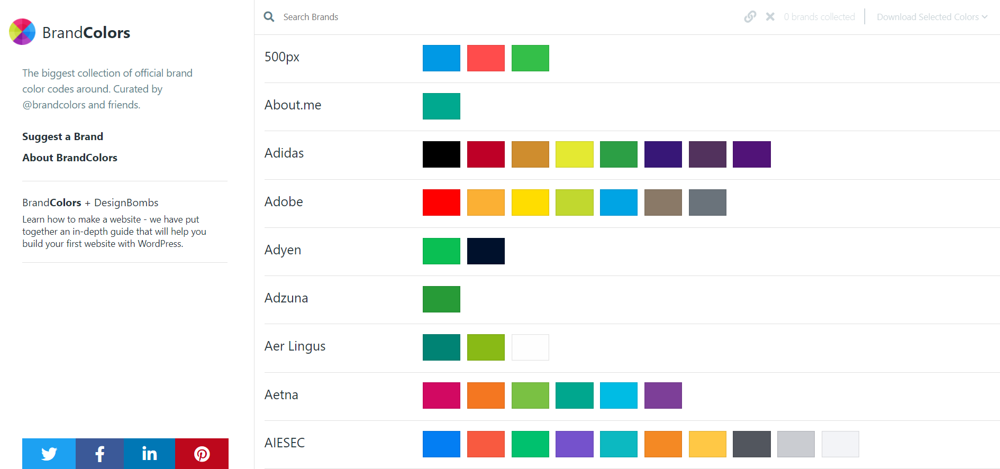

# Brand Colors

Easily access popular brand colors such as Netflix, Facebook, Google, and more.

## Features

- A collection of popular brand colors
- Easy-to-use API or static file access
- Organized color data for developers and designers

## Installation

To get started, clone the repository:

```sh
git clone https://github.com/yourusername/brand-colors.git
cd brand-colors
```

## Usage

### Running the Project

Start the project using:

```sh
npm install
npm start
```

or if using Yarn:

```sh
yarn install
yarn start
```

## Contributing

Contributions are welcome! Feel free to submit a pull request.

## Demo

[https://brandcolors-vue.netlify.app/](https://brandcolors-vue.netlify.app/)

## Project Image



---

For any inquiries, feel free to reach out or create an issue.

